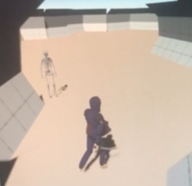
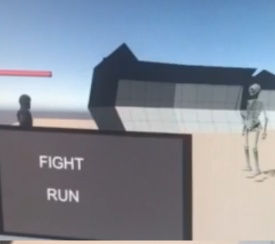

# 3D Turn Based RPG game using Unity. Game Design Project from Study Abroad at HAMK.

Player can explore a cave using WASD and spring while holding shift.

When a skeleton is encountered, a battle is instanced. If the Player beats the skeleton, the Player may continue exploring. If the Player loses against the skeleton, the Player will start at the beginning of the cave.
